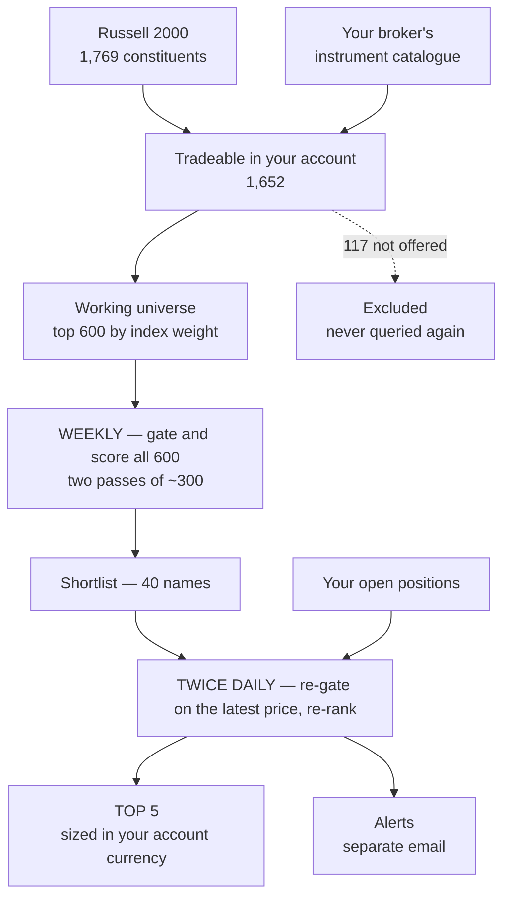
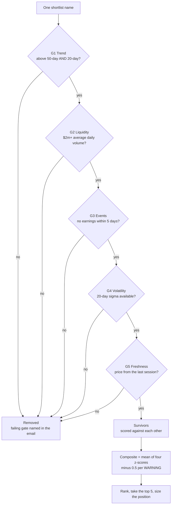

# Signal Generator

A rules-based screening system for US small-cap equities, run by scheduled LLM agents.
It narrows the Russell 2000 to five daily candidates, sizes them, and monitors open
positions.

**It never tells you what to buy.** It screens; you decide.

| | |
|---|---|
| **Universe** | Russell 2000 ∩ what your broker offers ∩ top 600 by weight |
| **Rebuilt** | quarterly |
| **Ranked** | weekly, two passes → a 40-name shortlist |
| **Screened** | 14:00 and 17:30 UK, weekdays → top 5 + alerts |
| **Data needed** | daily OHLCV, an earnings date, an FX rate. Nothing else |
| **Runs on** | a free API tier |

Jump to: [How picks are made](#how-the-five-picks-are-made) ·
[What to expect](#what-to-expect) · [Market data](#market-data) ·
[Setup](#setup) · [Using it](#using-it)

---

## How the five picks are made



The 117 names your broker does not offer are excluded once and never queried again.
Open positions are re-screened every run, whether or not they still rank.

### Gates first — no score rescues a failure



| Gate | OK | WARNING (−0.5) | FAIL (removed) |
|---|---|---|---|
| **G1 Trend** | above both averages, ≥2% clear of the 50-day | above both, within 2% | below either |
| **G2 Liquidity** | ≥ $5m avg daily volume | $2m – $5m | under $2m |
| **G3 Events** | no earnings for 10 trading days | earnings day 6–10 | earnings within 5 days |
| **G4 Volatility** | sigma from ≥ 20 sessions | 10–19 sessions | no sigma |
| **G5 Freshness** | last completed session | — | stale or missing |

### Then four factors, equally weighted

Survivors are z-scored **against each other**:

1. **Momentum** — 126-day return, excluding the last 21 days
2. **Relative strength** — 63-day return minus the index ETF's
3. **Risk-adjusted momentum** — factor 1 ÷ annualised volatility
4. **52-week high proximity** — close ÷ 52-week high

A composite of +1.2 means *"best of what passed today"*, not *"good"*. In a weak
tape all five can be mediocre and the score will not say so. Fewer than five
qualifiers means a shorter email, never a padded list.

> Richer diagrams with the rules drawn inline:
> [`docs/how-picks-are-made.html`](docs/how-picks-are-made.html) — open locally,
> GitHub will not render it.

---

## What to expect

40,000 simulated months, block-bootstrapped from real daily returns of a
41%-vol cohort, realistic costs, £100 stake. Scaling the stake does not change the
probabilities.

| Hit rate | Median month | Break even | ≥ £110 | ≤ £90 |
|---|---|---|---|---|
| 50% — no skill | £100.55 | 53.2% | 9.0% | 6.8% |
| 55% — good | £101.19 | 57.4% | 9.8% | 5.7% |
| 60% — very good | £101.90 | 61.7% | 11.2% | 5.0% |
| 65% — exceptional | £102.46 | 65.8% | 12.3% | 4.1% |

**The gap between no skill and exceptional skill is about 2% a month.** Most of the
median is market drift. The screen's realistic contribution is a few tenths of a
percent plus fewer bad months.

Two caveats that cut against the table: 2013–18 was a bull market, which flatters
any long-only baseline; and the hit rate is an **input** to the simulation, not
something this screen has been shown to achieve.

If you want a system that turns a small stake into a large one, this is not it —
[`research/FINDINGS.md`](research/FINDINGS.md) shows why nothing of this shape is.

---

## Design decisions

| Decision | Why |
|---|---|
| **Stop = 3.0 × the stock's 20-day sigma** | Volatility-invariant — touched in ~33% of 21-day holds on both a 25%-vol and a 41%-vol cohort. A fixed-percentage stop is too tight for volatile names and too loose for calm ones. |
| **20-day average is an alert, not an exit** | As an exit it cut the median month £101.10 → £99.07, break-even 57% → 45%, and quadrupled round trips. It fires on 84% of positions within a month. |
| **Buying optional, selling mechanical** | Entries are your call from a ranked screen. Exits are a stop or a day count, so every email opens with one ACTION line. |
| **Leaving the top 5 is not a sell signal** | The ranking concerns candidates. A position is governed by its stop and its 21-day clock, nothing else. |
| **Match brokers on display symbol, not ID** | Broker IDs freeze the ticker from listing day and are never revised after renames or SPAC mergers. Matching on the ID alone misclassified 233 names — in both directions. |

---

## Layout

```
rulebook/    the rules every agent reads first — the single source of truth
universe/    builder script + the generated eligible universe
agents/      one markdown file per scheduled run, ready to paste into a scheduler
research/    the calibration: data cleaning, Monte Carlo, verification
desk/        a single-page position log the agents read from and write to
docs/        a richer HTML version of the flow charts above
```

---

## Market data

No intraday bars, no fundamentals, no news feed. Every indicator — both moving
averages, the sigma, all four factors, dollar volume — is computed locally from one
daily price series per symbol.

| Stage | Needs | Calls | How often |
|---|---|---|---|
| Universe build | index constituents + weights; broker catalogue | 1 + 1 | quarterly |
| Weekly rank | ~1 year daily OHLCV, + next earnings date | 1–2 per symbol | weekly |
| Daily screen | OHLCV for shortlist + positions, FX rate, index ETF | ~50 | twice daily |

### The three providers

| | Free tier | Role here | First paid tier |
|---|---|---|---|
| **Twelve Data** | 8 credits/min, 800/day, 1 per symbol | the workhorse — OHLCV, FX, earnings dates | Grow **$79/mo** (377/min) |
| **Alpha Vantage** | 25 requests/day | the quarterly one-off: `ETF_PROFILE` on IWM returns ~1,795 Russell holdings in **one call** | 75/min, $49.99/mo |
| **FMP** | 250/day, end-of-day only | cross-checking a price or date | Starter $19/mo; ETF holdings need Ultimate $99 |

- **Twelve Data's binding limit is per-minute, not per-day.** One credit per symbol
  whether you batch or not — batching saves round trips, never credits.
- **Alpha Vantage's 25/day is fine** because you need it four times a year. Do not
  run the recurring screens on it.
- **FMP gates more than its limits suggest.** On the free tier `quote`, `chart`,
  `technicalIndicators` and ETF holdings all return access errors.

**Workable free combination:** Alpha Vantage quarterly, Twelve Data for everything
weekly and daily. That is the reference setup, and it sets the number below.

### Why 600 names

Wall-clock arithmetic on a free tier, not a view about the other 1,052:

```
600 symbols = 600 credits   — inside the 800/day cap
600 ÷ 8 per minute          = 75 minutes elapsed
```

The quota is not the problem; **75 minutes in one scheduled run is.** Hence two
weekend passes of ~300. The top 600 covers **78% of the index by weight** (cutoff
~0.05%); the names dropped are the smallest and least liquid, most of which fail
the $2m gate anyway.

| Want | Do | Cost | Run time |
|---|---|---|---|
| 600 (as shipped) | two weekend passes | free | ~38 min each |
| ~900 | three passes | free | ~56 min each |
| ~1,500 | ~750 per weekend day, near the 800 ceiling | free | ~94 min, fragile |
| all 1,652 | Twelve Data **Grow** | $79/mo | ~5 min, single pass |

Raising it is one number: `U3` in the rulebook plus the slice size in the weekly
agents. The universe file is already weight-ranked.

**Grow removes the constraint; Pro at $229 buys nothing this system uses.** Whether
$79/month is worth it against a £100 stake is answered by the table in
[What to expect](#what-to-expect): it is not, until the process has proved itself
at a size where it matters.

---

## Setup

<details>
<summary><b>Why this looks harder than it is</b></summary>

Three of the four steps exist only because this is a **public repo and the pieces
are account-scoped** — your email, your broker's instrument list, your scheduler.
None of it is configuration for its own sake.

**Skip most of it for a first look.** `universe/eligible-universe.md` is already
built and committed:

1. Get a free Twelve Data key.
2. Paste `agents/pre-open-screen.md` into any LLM agent with API access, run it by hand.
3. Read the email it drafts instead of sending.

Fifteen minutes, no broker key, no scheduler, no hosting.

</details>

**1. Fill the placeholders**

| Placeholder | Replace with |
|---|---|
| `{{YOUR_EMAIL}}` | the address the agents email |
| `{{DESK_URL}}` | wherever you host `desk/index.html` |

```bash
grep -rl '{{YOUR_EMAIL}}\|{{DESK_URL}}' .
```

**2. Build the universe** — *skip if the committed file suits you; it only needs
rebuilding quarterly, or if your broker differs from the reference one.*

Two inputs, neither committed here:

- **Broker instrument catalogue** — JSON array with at least `ticker`, `type`,
  `currencyCode`, `shortName`, `isin`, `name`. Most brokers expose this from an
  authenticated metadata endpoint.
- **Index constituents** — anything giving Russell 2000 symbols and weights;
  Alpha Vantage `ETF_PROFILE` on IWM does it in one free call.

```bash
python3 universe/build_universe.py broker_instruments.json index_holdings.json \
        universe/eligible-universe.md
```

Assumes a `SYMBOL_US_EQ` style ID — adjust `load_broker()` if yours differs.

**3. Wire up the agents** — each file in `agents/` is a self-contained prompt for
one run. Point your scheduler at the cron expressions in each header and give the
runs a data provider and an email sender.

Cron is UTC, run times are UK local, so `agents/clock-change.md` re-anchors the
expressions at each UK clock change. Set it up or accept an hour of drift twice a year.

> **Order matters.** The daily screens depend on a shortlist the weekend rank
> produces — read [The cold start](#the-cold-start) before enabling any schedule.

**4. Host the desk** — `desk/index.html` is one self-contained page: positions,
latest picks and alerts, USD → account currency with your broker's FX fee applied
in the correct direction each side. Adapt the persistence block at the foot of the
file, or run it on `localStorage`.

**Monitoring only sees what is logged.** An unrecorded position gets no stop check,
no alert, no countdown.

---

## Using it

### The cold start

The daily screen does not scan the universe — it re-gates a **40-name shortlist**
built at the weekend. Until that exists, a daily run emails an empty screen.

**Friday evening or early Saturday** — do nothing, the schedule handles it:

| Sat 08:00 | Sun 08:00 | Mon 14:00 |
|---|---|---|
| part 1 ranks ~300, silent unless it fails | part 2 ranks the rest, emails the shortlist | first real picks email |

**Mid-week** — produce a shortlist by hand first:

| Option | How | Trade-off |
|---|---|---|
| Same day | part 1 then part 2 back to back | 600 credits, ~38 min each; leaves ~200 of the day's 800 — one daily screen, not two |
| Split | part 1 today, part 2 tomorrow | slower to first output, comfortable budget, safer while you are still confirming the key works |

**Saturday after 08:00** — run part 1 manually; Sunday's scheduled part 2 picks up.
**Sunday after 08:00** — run both, or wait for next weekend and read the rulebook
instead.

> **Do not enable the 14:00 / 17:30 schedules until part 2 has finished.**

The shortlist being a week old by Friday is *by design*: the daily pass re-gates
every name on the latest close. The weekly pass decides who is **considered**; the
daily pass decides who **survives**.

### A normal week

| When | What arrives |
|---|---|
| Sun 08:00 | the week's 40-name shortlist |
| Weekdays 14:00 | picks email — ACTION line, top 5, sizes, stops, your positions |
| Weekdays 17:30 | the same, re-run on mid-session prices, framed as changes since 14:00 |
| Any run | a **separate** alert email, only if something fired |

The 17:30 run is a diff, not a fresh list. It exists because 14:00 is pre-open and
can only speak to yesterday's close, while 17:30 is late enough in the US session
for a stop distance or a moving-average break to mean something — and early enough
in the UK evening to act on.

### What a month actually looks like

| | |
|---|---|
| First fortnight | one or two positions, possibly none — you are capped at four and buying is optional |
| Round trips | ~5–6 a month if you act on most picks |
| Stop-outs | ~1 position in 3 — the calibrated rate, not a fault |
| 20-day alerts | 3–4 a month once you hold four. Prompts to look, never instructions to sell |
| The money | flat. See [What to expect](#what-to-expect) |

**It will never** name a buy, give a price target, call a position attractive, or
act between runs — the stop lives with your broker precisely because this system is
asleep 22 hours a day.

### Judging it

Not by the balance: one month at this scale is almost entirely noise.

1. **Adherence.** Real stop orders placed every time? Every position logged on the
   desk? Exits taken when the rules said, not when you felt like it?
2. **Measured hit rate**, once you have 30 closed trades. The simulations take the
   hit rate as an input — finding out whether the composite achieves it is the
   actual experiment.

Part I of the rulebook sets the re-examine thresholds: a stop-out rate above 45%
over 20 trades, or a hit rate below 45% over 30.

---

## Appendix: if your broker is Trading 212

The reference implementation was built against a Trading 212 Stocks & Shares ISA.

<details>
<summary><b>Getting the instrument catalogue</b></summary>

Generate a read-only key: **Settings → API (Beta) → Generate API key**. You get an
API Key and an API Secret; the API uses HTTP Basic with both.

```bash
curl -sS -u "API_KEY:API_SECRET" \
  "https://live.trading212.com/api/v0/equity/metadata/instruments" \
  -o broker_instruments.json -w "status=%{http_code} bytes=%{size_download}\n"
```

- **Rate limit: one request per 50 seconds.** Wait a full minute before retrying or
  the 429 looks like a different error.
- **IP restrictions** are offered at key generation — if set, the request must come
  from that address.
- **Account type:** the public API covers Invest and Stocks ISA, not CFD. Generate
  the key on the account you actually trade.

~18,000 instruments come back; the builder filters to US common stock in USD,
leaving about 6,900.

</details>

<details>
<summary><b>The ticker trap</b></summary>

`ticker` is an internal ID fixed at listing. `shortName` is the current symbol.

| Index says | Broker ID | Displays as |
|---|---|---|
| IONQ | `DMYI_US_EQ` | IONQ |
| ASGN | `ASGN_US_EQ` | EFOR |
| SATS | `SATS_US_EQ` | ECHO |
| ACHR | `ACIC_US_EQ` | ACHR |
| KAR | `KAR_US_EQ` | OPLN |

Search the app by the **broker ID**; recognise the company by the **current
symbol**. The builder emits both columns for this reason.

</details>

- **FX fee 0.15% each way** — sterling account, USD stocks, so it applies on entry
  and exit. Modelled directionally: buy `(USD / rate) × 1.0015`, sell `× 0.9985`.
- **Fractional shares** supported — this is what makes small positions workable.
- **No shorting in an ISA** — every candidate is a long, which is why the trend gate
  only looks *above* the averages.
- **Place the stop as a real order** at entry. The emails report twice a day; they
  cannot act between runs.
- **US-domiciled ETFs, leveraged included, cannot be bought by UK retail** in any
  account. PRIIPs requires a KID that US issuers do not produce. Ordinary US common
  stock — what this screens — is unaffected.

---

## Reproducing the calibration

```bash
pip install numpy pandas
cd research
python3 0_explore.py      # fetch and inspect the daily return dataset
python3 1_clean_splits.py # detect and back-adjust unadjusted stock splits
python3 2_calibrate.py    # sweep stop width, hold period, sizing, exit rules
python3 3_verify.py       # controls, scaling checks, alert frequency
```

`1_clean_splits.py` matters more than it sounds: the source uses unadjusted closes,
and four splits were inflating measured excess kurtosis from 13 to 119 — entirely
fictional tail risk — until corrected.

---

## Disclaimer

**Not financial advice.** A personal research project published for reference, not
a recommendation and not a product. Nothing here has been tested with real money at
any meaningful scale.

Small-cap equities can lose value rapidly and permanently. The simulations describe
one historical sample under stated assumptions; live results will differ and a
falling market shifts every figure down. Run it with money you can afford to lose
entirely, and place real stop orders with your broker rather than relying on an
email. The author is not a licensed financial adviser.

---

## Licence

MIT — see [`LICENSE`](LICENSE).
