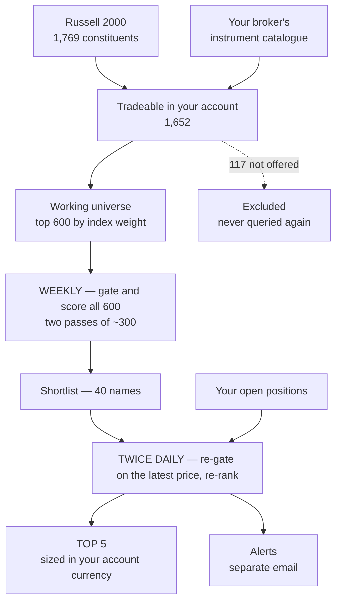
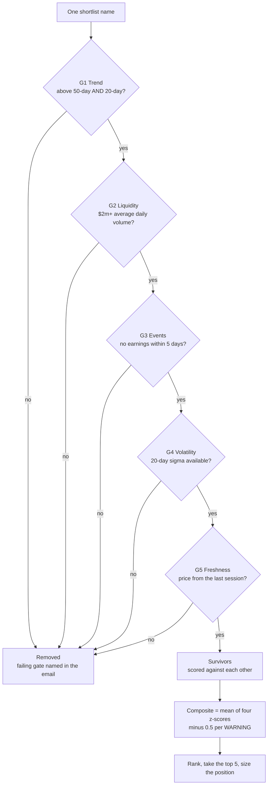

# Signal Generator

A rules-based screening system for US small-cap equities, run by scheduled LLM
agents. It narrows the Russell 2000 to five daily candidates, sizes them, and
monitors open positions — and it is deliberately built so that **it never tells you
what to buy**.

It screens. You decide.

---

## What it does

Three stages on three clocks:

| Stage | When | Work |
|---|---|---|
| **Universe build** | quarterly | Russell 2000 ∩ broker-tradeable ∩ top 600 by index weight |
| **Weekly rank** | weekend, 2 passes | gate and score all 600 → a 40-name shortlist |
| **Daily screen** | 14:00 and 17:30 UK | re-gate the shortlist + your holdings → top 5, plus alerts |

Each daily run emails a ranked five with the evidence behind each name, the stop
price, the position size in your account currency, and the status of everything you
already hold. A separate alert email fires when a position breaches its stop, drops
below its 20-day average, approaches its hold limit, or runs into earnings.

---

## How the five picks are made

### The funnel



The 117 names the broker does not offer are excluded once and never queried again.
Open positions are screened alongside the shortlist every run, whether or not they
still rank.

### Gates first — and they are absolute

No composite score rescues a name that fails a gate.



### The exact thresholds

| Gate | OK | WARNING (−0.5) | FAIL (removed) |
|---|---|---|---|
| **G1 Trend** | above both averages, ≥2% clear of the 50-day | above both, within 2% of the 50-day | below either average |
| **G2 Liquidity** | ≥ $5m average daily volume | $2m – $5m | under $2m |
| **G3 Events** | no earnings for 10 trading days | earnings on day 6–10 | earnings within 5 days |
| **G4 Volatility** | sigma from ≥ 20 sessions | 10–19 sessions | no sigma available |
| **G5 Freshness** | last completed session | — | stale or missing |

### Then four factors, equally weighted

Survivors are z-scored **against each other**, so the composite is relative:

1. **Momentum** — 126-day return, excluding the most recent 21 days
2. **Relative strength** — 63-day return minus the index ETF's
3. **Risk-adjusted momentum** — factor 1 divided by annualised volatility
4. **Proximity to the 52-week high** — close ÷ 52-week high

A score of +1.2 means "well above the others that passed today", not a fixed
quality bar. In a weak tape the top five may all be mediocre in absolute terms,
and the score will not tell you that.

If fewer than five clear every gate, the email sends fewer and says why. It never
pads the list.

> A richer version of these diagrams, with the gate rules drawn inline, is in
> [`docs/how-picks-are-made.html`](docs/how-picks-are-made.html) — open it locally,
> GitHub will not render it.

---

## Read this before anything else

Calibrated on 40,000 simulated months, block-bootstrapped from real daily returns
of a 41%-annualised-volatility cohort, with realistic costs. Figures for a £100
stake; the probabilities do not change if you scale it.

| Directional hit rate | Median month | Break even | ≥ £110 | ≤ £90 |
|---|---|---|---|---|
| 50% (no skill) | £100.55 | 53.2% | 9.0% | 6.8% |
| 55% (good) | £101.19 | 57.4% | 9.8% | 5.7% |
| 60% (very good) | £101.90 | 61.7% | 11.2% | 5.0% |
| 65% (exceptional) | £102.46 | 65.8% | 12.3% | 4.1% |

**The gap between no skill and exceptional skill is about 2% a month.** Most of the
median outcome is market drift, not selection. The screen's realistic contribution
is a few tenths of a percent plus a meaningful reduction in bad months.

Two caveats that cut against those numbers: the sample period (2013–18) was a bull
market, so a long-only baseline is flattered; and the hit rate is an **input** to
the simulation, not something this screen has been shown to achieve.

If you are looking for a system that turns a small stake into a large one, this is
not it, and the arithmetic in [`research/FINDINGS.md`](research/FINDINGS.md)
explains why no system of this shape is.

---

## Design decisions worth knowing

**The stop is calibrated, not chosen.** `stop = 3.0 × the stock's 20-day daily
sigma`. That multiple is volatility-invariant: it is touched in ~33% of 21-day
holds on both a 25%-vol and a 41%-vol cohort. A fixed percentage stop is the
classic mistake — simultaneously too tight for volatile names and too loose for
calm ones.

**The 20-day moving average is an alert, not an exit.** Tested as an exit rule it
cut the median month from £101.10 to £99.07, dropped break-even odds from 57% to
45%, and quadrupled the number of round trips. It fires on 84% of positions within
a month. Useful as a prompt to look; destructive as a trigger to sell.

**Buying is optional, selling is not.** Entries are your judgement call from a
ranked screen. Exits are mechanical — a stop level or a day count — so every email
opens with a single ACTION line stating what the rules require, or that they
require nothing.

**A name leaving the top 5 is not a sell signal.** The ranking concerns candidates,
not holdings. Once a position exists it is governed by the stop and the hold cap,
and nothing else.

**Broker instrument IDs go stale.** Brokers commonly use an internal ID that
preserves the ticker from the day the instrument was listed, and never revise it
after a rename or a SPAC merger. Matching index constituents on that ID alone
misclassified 233 names when this was built — in both directions. The universe
builder matches on the current display symbol first and records which route it used.

---

## Layout

```
rulebook/    the rules every agent reads first — the single source of truth
universe/    builder script + the generated eligible universe
agents/      one markdown file per scheduled run, ready to paste into a scheduler
research/    the calibration: data cleaning, Monte Carlo, verification
desk/        a single-page position log the agents read from and write to
docs/        a richer HTML version of the flow charts above
```

---

## Setup

### 1. Fill in the placeholders

| Placeholder | Replace with |
|---|---|
| `{{YOUR_EMAIL}}` | the address the agents email |
| `{{DESK_URL}}` | wherever you host `desk/index.html` |
| `{{YOUR NAME}}` | copyright holder in `LICENSE` |

```bash
grep -rl '{{YOUR_EMAIL}}\|{{DESK_URL}}\|{{YOUR NAME}}' .
```

### 2. Build the universe

Two inputs, neither committed here:

- **Your broker's instrument catalogue** — a JSON array of instruments with at
  least `ticker`, `type`, `currencyCode`, `shortName`, `isin` and `name`. Most
  brokers expose this from an authenticated metadata endpoint. See the appendix
  below for a worked example.
- **Index constituents** — any source giving Russell 2000 symbols and weights. An
  IWM holdings dump works; Alpha Vantage's `ETF_PROFILE` returns ~1,795 rows.

```bash
python3 universe/build_universe.py broker_instruments.json index_holdings.json \
        universe/eligible-universe.md
```

The script assumes a `SYMBOL_US_EQ` style instrument ID; adjust the filter in
`load_broker()` if your broker uses a different convention.

### 3. Wire up the agents

Each file in `agents/` is a self-contained prompt for one scheduled run. Point your
scheduler at them using the cron expressions in each header, and give the runs
access to a market-data provider and an email sender.

Cron is evaluated in UTC while the run times are UK local, so
`agents/clock-change.md` shifts the expressions automatically at each UK clock
change. Set that one up too, or accept an hour of drift twice a year.

### 4. Host the desk

`desk/index.html` is a single self-contained page. It stores positions, shows the
latest picks and alerts, and converts USD prices to your account currency including
your broker's FX fee in the correct direction on each side. It expects a small JSON
document store; adapt the persistence block at the bottom of the file to whatever
you have, or run it standalone on `localStorage`.

**Monitoring only sees what is logged.** A position bought and not recorded gets no
stop check, no alert and no hold-period countdown.

---

## Appendix: if your broker is Trading 212

The reference implementation was built against a Trading 212 Stocks & Shares ISA.
If that is your broker too, here are the specifics.

### Getting the instrument catalogue

Generate a read-only API key in the app: **Settings → API (Beta) → Generate API
key**. You get two values, an API Key and an API Secret. The API uses HTTP Basic
auth with both:

```bash
curl -sS -u "API_KEY:API_SECRET" \
  "https://live.trading212.com/api/v0/equity/metadata/instruments" \
  -o broker_instruments.json -w "status=%{http_code} bytes=%{size_download}\n"
```

Three things that will catch you out:

- **Rate limit: one request per 50 seconds** on this endpoint. If the first attempt
  fails, wait a full minute before retrying or the 429 will look like a different
  error.
- **IP restrictions.** The key-generation form offers them. If you set one, the
  request must come from that address.
- **Account type.** The public API covers Invest and Stocks ISA only, not CFD.
  Generate the key on the account you actually trade so the catalogue matches what
  you can buy.

The response is roughly 18,000 instruments. The builder filters to US common stock
quoted in USD, which leaves about 6,900.

### The ticker trap, with real examples

Trading 212's `ticker` field is an internal ID fixed at listing time. `shortName`
is the current symbol. They diverge after renames and SPAC mergers:

| Index says | Broker ID | Currently displays as |
|---|---|---|
| IONQ | `DMYI_US_EQ` | IONQ |
| ASGN | `ASGN_US_EQ` | EFOR |
| SATS | `SATS_US_EQ` | ECHO |
| ACHR | `ACIC_US_EQ` | ACHR |
| KAR | `KAR_US_EQ` | OPLN |

Search the app by the **broker ID**; recognise the company by the **current
symbol**. The builder emits both columns for exactly this reason.

### Costs and account constraints

- **FX fee: 0.15% each way.** The account is sterling, the stocks are USD, so it
  applies on entry and exit. The rulebook and the desk both model it directionally:
  a buy costs `(USD / rate) × 1.0015`, a sale nets `(USD / rate) × 0.9985`.
- **Fractional shares** are supported, which is what makes small position sizes
  workable.
- **No shorting inside an ISA.** Every candidate is a long — this is why the trend
  gate only ever looks for names *above* their moving averages.
- **Place the stop as a real order** at entry. The emails report status twice a day;
  they cannot act between runs.

### What is not available

US-domiciled ETFs — including leveraged ones — cannot be bought by UK retail
investors in any account, ISA included. PRIIPs requires a Key Information Document
that US issuers do not produce. Ordinary US common stock, which is what this system
screens, is unaffected.

---

## Reproducing the calibration

```bash
pip install numpy pandas
cd research
python3 0_explore.py      # fetch and inspect the daily return dataset
python3 1_clean_splits.py # detect and back-adjust unadjusted stock splits
python3 2_calibrate.py    # sweep stop width, hold period, sizing, exit rules
python3 3_verify.py       # controls, scaling checks, alert frequency
```

`1_clean_splits.py` matters more than it sounds: the source data uses unadjusted
closes, so four stock splits were inflating measured excess kurtosis from 13 to 119
and producing entirely fictional tail risk until they were corrected.

---

## Disclaimer

This is a personal research project published for reference. It is **not financial
advice**, not a recommendation to buy or sell anything, and not a product. Nothing
here has been tested with real money at any meaningful scale.

Small-capitalisation equities can lose value rapidly and permanently. The
simulation results describe one historical sample under a set of stated
assumptions; live results will differ, and a falling market shifts every figure
down. If you run this, run it with money you can afford to lose entirely, and place
real stop orders with your broker rather than relying on an email.

The author is not a licensed financial adviser.

---

## Licence

MIT — see [`LICENSE`](LICENSE).
